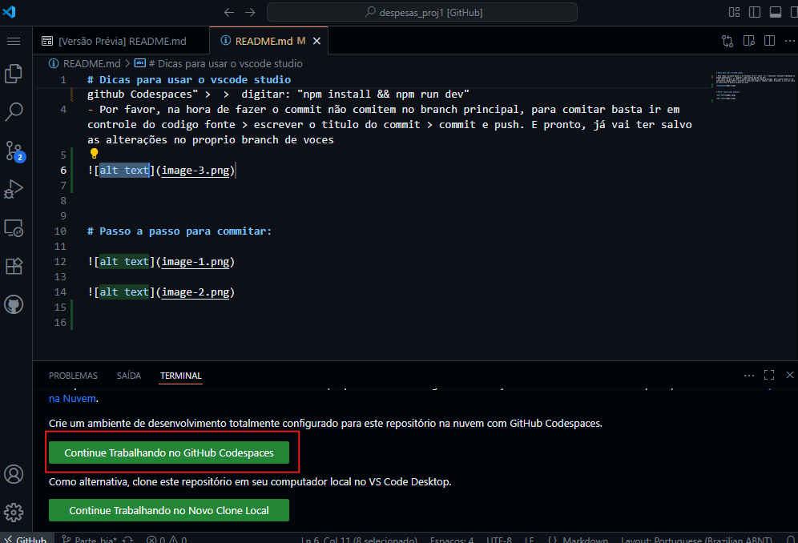
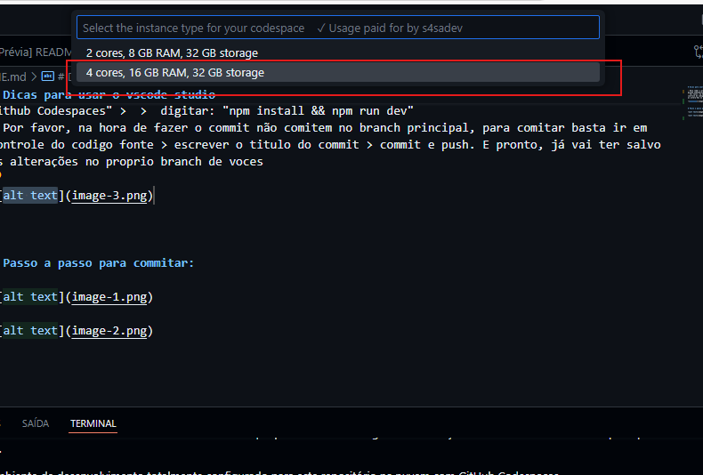
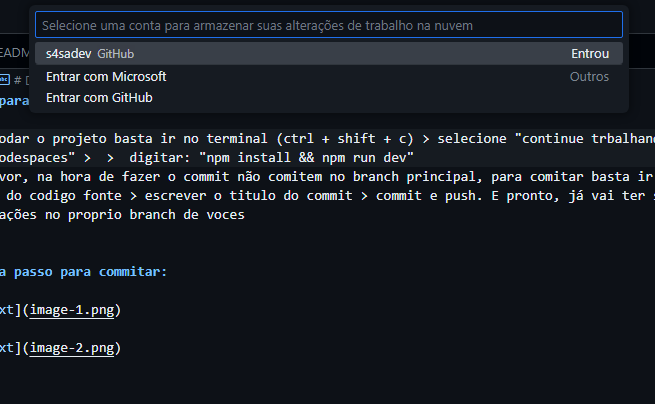
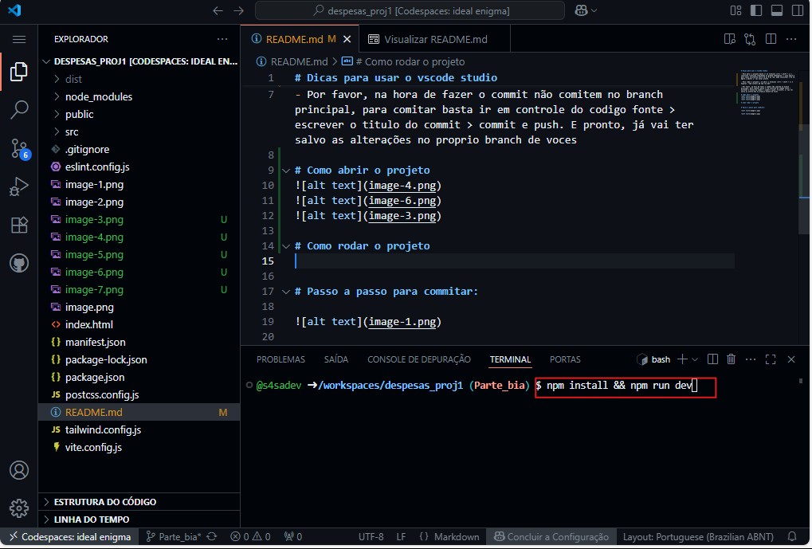
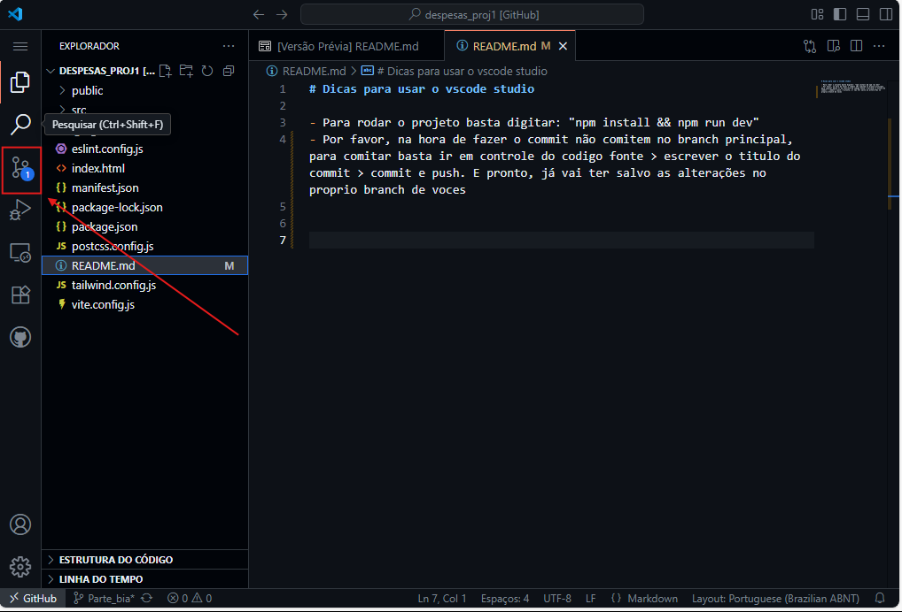
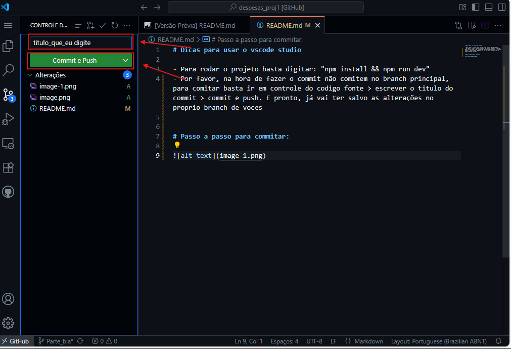
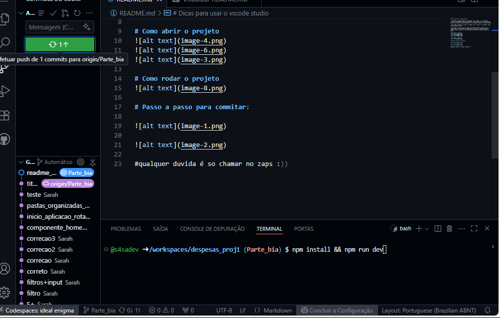
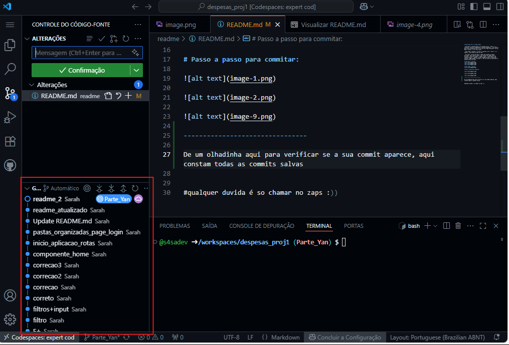

# Dicas para usar o vscode studio

- Para abrir o projeto basta ir no terminal (ctrl + shift + c) > selecione "continue trabalhando no github Codespaces" > caso apareça para voces escolherem entre 16 ou 8 de ram, pode selecionar o de 16. Agora o editor já vai estar pronto (o editor verdadeiro vai ser aberto em uma outra aba do navegador quando for feito o processo acima)

- Para rodar o projeto é só abrir o terminal (ctrl + shift + c) e digitar: "npm install && npm run dev"

- Por favor, na hora de fazer o commit não comitem no branch principal, para comitar basta ir em controle do codigo fonte > escrever o titulo do commit > commit e push > (caso apareça uma setinha de girar, confome a ultima *imagem do passo a passo para comitar*, PODE CLICAR). E pronto, já vai ter salvo as alterações no proprio branch de voces

# Como abrir o projeto

# Como rodar o projeto

# Passo a passo para commitar: 

# OBS

De um olhadinha aqui para verificar se a sua commit aparece, aqui constam todas as commits salvas

#qualquer duvida é so chamar no zaps :))